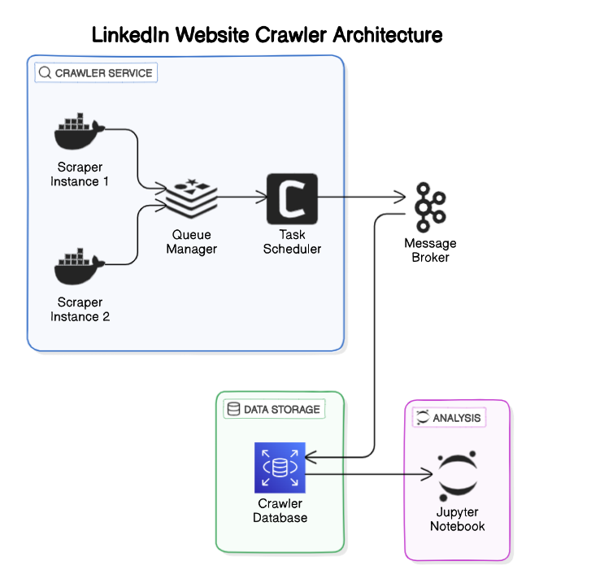

## Clone the repository
git clone https://github.com/your-username/linkedin-scraper.git
cd linkedin-scraper

## Create .env file with LinkedIn credentials
LINKEDIN_EMAIL=your-email@example.com
LINKEDIN_PASSWORD=your-password
EOF

## Build and run the Docker container
docker build -t linkedin-scraper .
docker run -d --name linkedin_scraper_container linkedin-scraper

## Access scraped data from Docker container
docker cp linkedin_scraper_container:/app/data ./data

# For Local Setup (Without Docker)

## Install dependencies using Poetry
poetry install

## Install Playwright browsers
poetry run playwright install

## Start Redis server (if Redis is used)
redis-server

## Run the scraper
python src/seed_initial_profiles.py || python src/main.py <linkedin_username> <linkedin_password>

